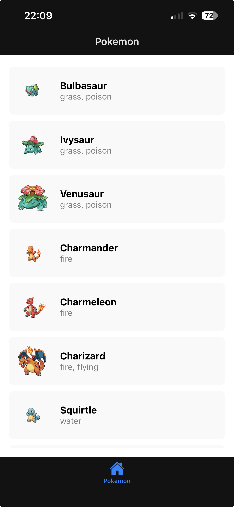

# Week 7: API Integration with PokeAPI

### 📸 Screenshot

Below is a screenshot of the Pokémon list displayed in the app:

(assets/pokemon-list 1.png)

### 🧩 API Integration Note

This project integrates the [PokéAPI](https://pokeapi.co/) using **Axios** to fetch and display Pokémon data dynamically.

Each Pokémon’s name, image, and type are retrieved from the `/api/v2/pokemon` endpoint with pagination support for smooth browsing.

The app also caches API responses using **AsyncStorage** to allow offline access and invalidates the cache every 24 hours for updated data.Additionally, pull-to-refresh and loading animations ensure a responsive and user-friendly experience on both Android and iOS.
